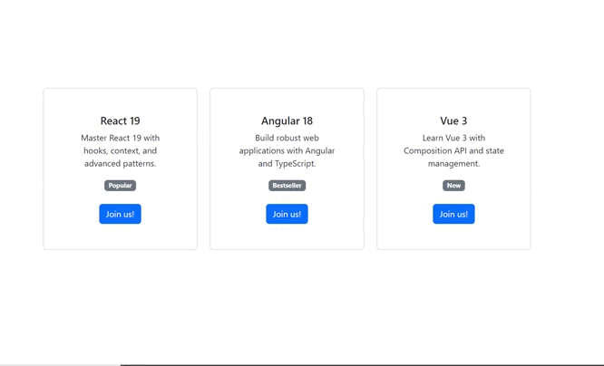

# Tarea 11 Interfaces de usuario -- React 19

Cosas a destacar:

Custom hook:
  - CourseJoined --> almacena el título y la imagen del curso seleccionado

Context:
  - CourseJoinedContext --> Permite tener accessibilidad al título del curso seleccionado a partir del botón de Join us! del componente Course.
    Para que en el componente del formulario se cargue una imagen, basandose en el título del curso elegido.

